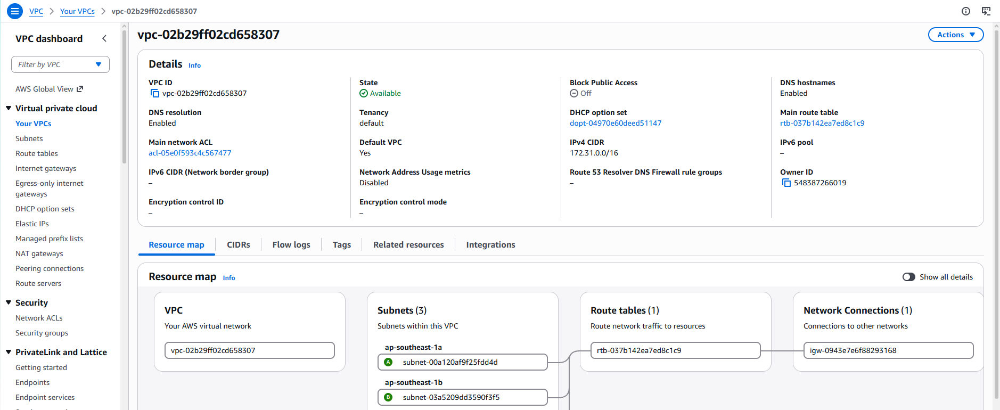
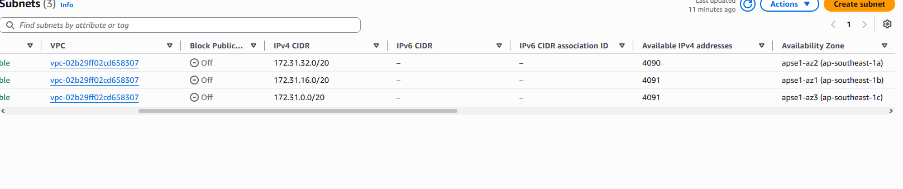
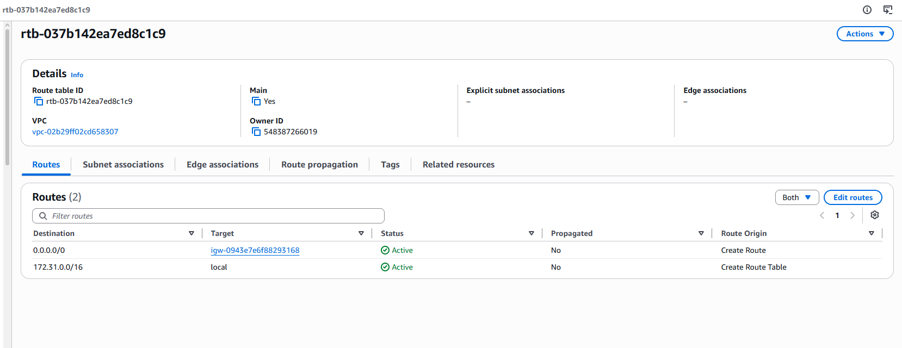
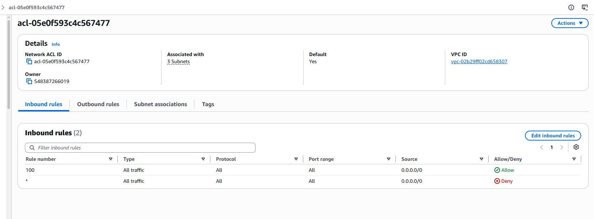
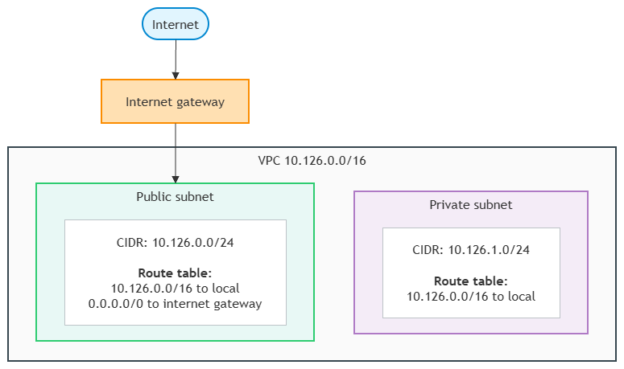

# Assignment 2 Submission

<!--
How to use this template:

1. Copy this file to submissions/assignment-2/<your-github-username>/submission.md
2. Replace every answer placeholder with your own answer. Delete the angle brackets too.
3. Save your four images in the same folder, with the exact file names below.
4. Do not write your full name or your student number in this file.
-->

## About me

- GitHub username: MadBunBun
- Section: IV-CCSAD
- IAM user name that I signed in with: ccsad-g06
- X: 126

---

## Part A. Explore

### A1. The VPC

Default VPC IPv4 CIDR:

172.31.0.0/16

Number of addresses in that CIDR:

65,536

### A2. The subnets

| Availability Zone | IPv4 CIDR |
| --- | --- |
| apse1-az2 (ap-southeast-1a) | 172.31.32.0/20 |
| apse1-az1 (ap-southeast-1b) | 172.31.16.0/20 |
| apse1-az3 (ap-southeast-1c) | 172.31.0.0/20 |

Screenshot 1. Save it as `screenshot-1-subnets.png` in your folder. The image line below shows it.

### A3. Available addresses

Available IPv4 addresses in each subnet:

|172.31.32.0/20| 4090 |    
|172.31.32.0/20| 4091 |
|172.31.0.0/20| 4091 |

Why is the number lower than 4,096?

AWS reserves 5 IP addresses in every subnet (network address, VPC router, Amazon-provided DNS, future use, and broadcast address), leaving a maximum of 4,091 usable IP addresses (4,096 - 5 = 4,091).

What uses the missing address in the subnet with the lowest number?

An EC2 instance (or an Elastic Network Interface / ENI).

### A4. The route table

| Destination | Target |
| --- | --- |
| 0.0.0.0/0 | screenshot-2-routes.png |
| 172.31.0.0/16 | local |

Screenshot 2. Save it as `screenshot-2-routes.png` in your folder. The image line below shows it.

### A5. Public or private

Are the default subnets public or private? Which route proves it?

Public. The route `0.0.0.0/0` with target `igw-0943e7e6f88293168` (the internet gateway) proves it because it routes default internet traffic directly to and from the internet.

### A6. The internet gateway

State of the internet gateway:

Attached

What happens to the default subnets if the gateway is detached?

The route `0.0.0.0/0` loses its active target, so all subnets lose access to and from the public internet. However, instances in the subnets can still communicate with each other locally via the `172.31.0.0/16` local route.

### A7. NAT gateways

Number of NAT gateways:

0

Can a server in a new private subnet download updates? Why?

No. A private subnet has no route to an internet gateway, and because there are no NAT gateways in the VPC, the private server has no outbound path to reach internet repositories to download updates.

### A8. The network ACL

| Rule number | Source | Allow or Deny |
| --- | --- | --- |
| 100 | 0.0.0.0/0 | Allow |
| * | 0.0.0.0/0 | Deny |

How is a network ACL different from a security group?

A network ACL is a stateless firewall applied at the subnet level that evaluates numbered rules sequentially and supports both Allow and Deny rules (requiring explicit rules for outbound response traffic). A security group is a stateful firewall applied to individual resources (like EC2 instances) that only supports Allow rules and automatically allows response traffic.

Screenshot 3. Save it as `screenshot-3-network-acl.png` in your folder. The image line below shows it.

### A9. The default security group

Inbound rule (type and source):

All traffic, from source `default` security group (self-referencing security group ID `sg-...`).

Which resources can send traffic to an instance that uses it?

Only resources (such as other EC2 instances) that are assigned the same `default` security group. All other traffic from external sources or other security groups is blocked.

---

## Part B. Prepare

### B1. Plan two subnets

- Public subnet CIDR:  10.126.0.0/24
- Private subnet CIDR: 10.126.1.0/24
### B2. Route tables

Route table of the public subnet:

| Destination | Target |
| --- | --- |
| 10.126.0.0/16 | local |
| 0.0.0.0/0 | internet gateway |

Route table of the private subnet:

| Destination | Target |
| --- | --- |
| 10.126.0.0/16 | local |

### B3. My VPC diagram

Tool used (Excalidraw, draw.io, Lucidchart, or paper):

draw.io

Save your diagram as `vpc-diagram.png` in your folder. The image line below shows it.

### B4. Predict a change

Can you still open the web page from your laptop? Why?

No. The laptop connects over the public internet. Without the `0.0.0.0/0` route pointing to an internet gateway, return traffic cannot reach internet addresses, even though the instance has a public IP address.

Can the instance still reach another instance in the VPC? Why?

Yes. The local route `172.31.0.0/16` (or `10.126.0.0/16`) remains in the route table. It handles all internal communication between subnets within the VPC, so internal traffic is unaffected.

### B5. Place a database

Which subnet gets the database? Why?

The private subnet (`10.126.1.0/24`). A database stores sensitive application data and should never be directly exposed to the public internet. Because the private subnet has no route to the internet gateway, external internet traffic cannot reach it, while authorized application servers in the public subnet can still query the database internally via the local route.

### B6. My question about VPCs

What is your question, and what made you think of it?

How do servers in two separate VPCs communicate with each other privately without routing over the public internet, and must their CIDR blocks be different? it me think of it because the activity showed that all subnets inside one VPC communicate through the local route. In real enterprise environments, organizations often separate departments or production environments into different VPCs. I wondered how internal connectivity works across VPC boundaries.
